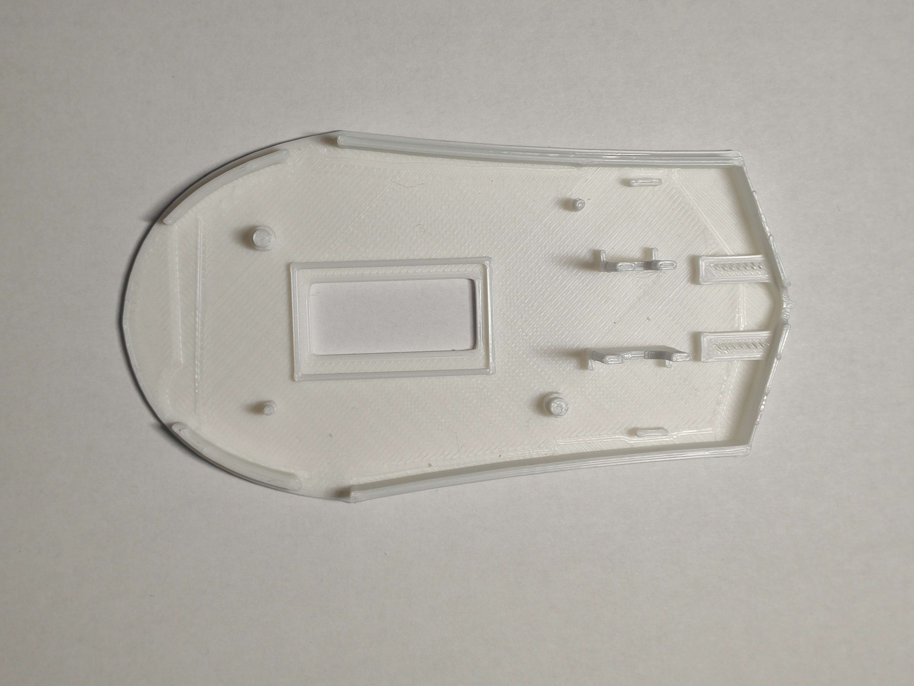
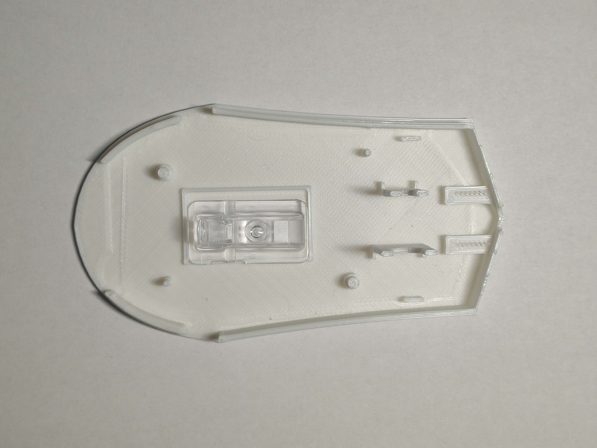
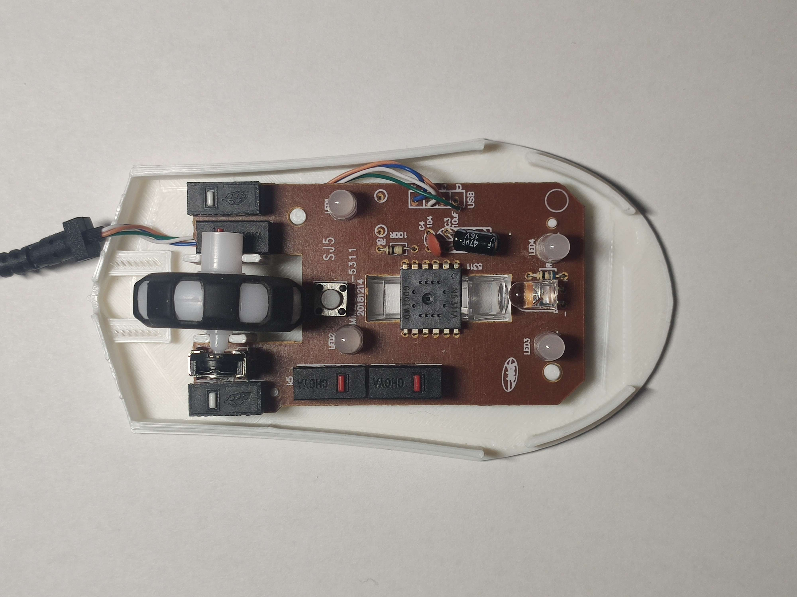
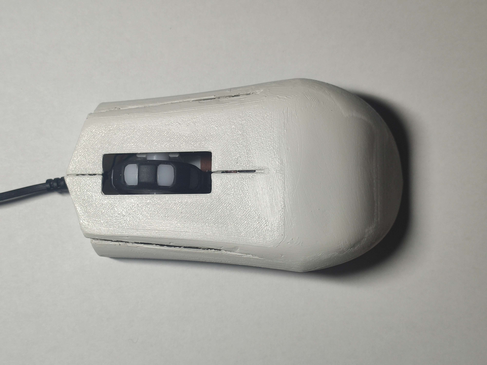

# Vkládání elektroniky dovnitř

## Krok 1:
Vlož optiku dovnitř myši

## Krok 2:
Vlož vše ostatní  
Dávej si pozor na správné položení na piny aby základna zůstala dlouhodobě na stejném místě

## Krok 3:
Jako předposlední krok Nandáme vrchní část na spodek

## Krok 4:
Nakonec Zaděláme dvěma šroubky ze předu výrobku 

## Krok 5:

Kdyby jsme chtěli tak můžem ještě nedokonalosti 
vyplnit tmelem a nasprejovat.