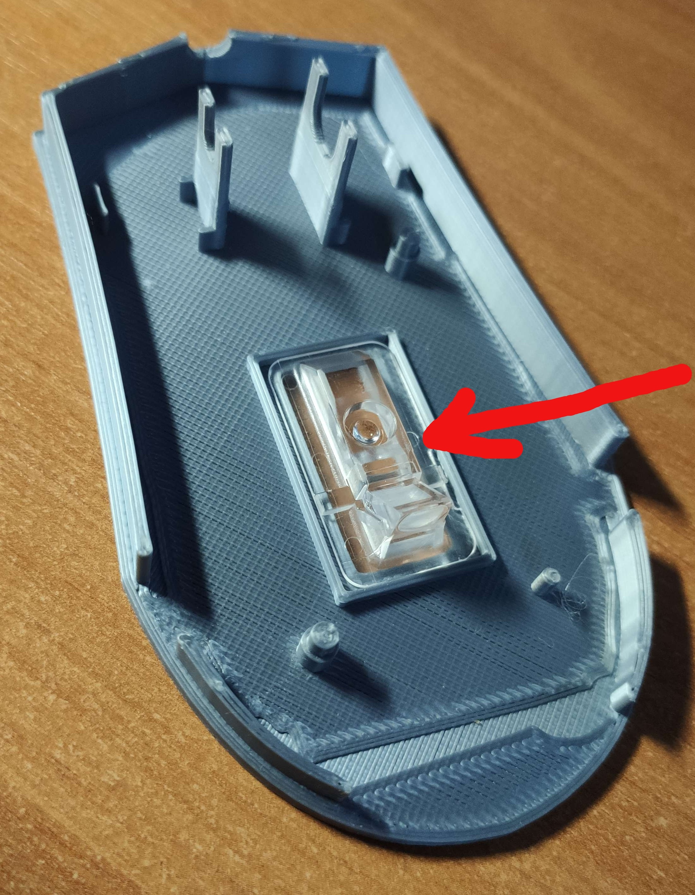

# Placing Electronics inside

## Step 1:
Vlož optiku dovnitř myši

## Step 2:
Vlož vše ostatní  
Dávej si pozor na správné položení na piny aby základna zůstala dlouhodobě na stejném místě

## Step 3:
Při konečné montáži už jen nasadíte horní část na dno,  
nepotřebujete žádné šrouby a je hotovo.  
Výstup by měl vypadat nějak takto

