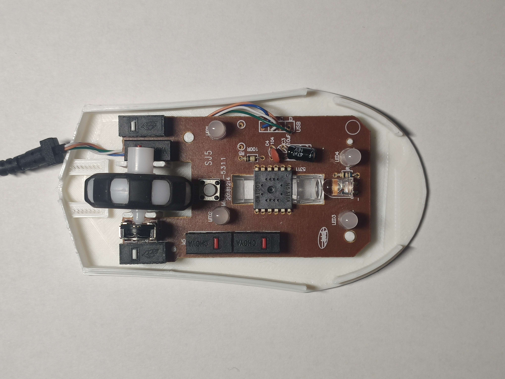
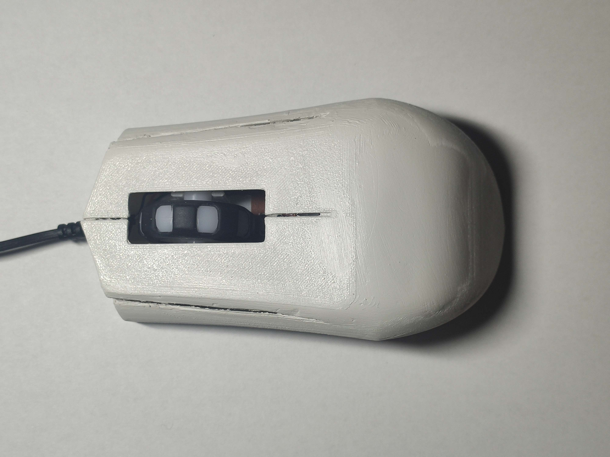

# Placing Electronics inside

## Step 1:
Place the Optics inside

## Step 2:
Place the rest  
Make sure it is right on the pins so it stays in place  

## Step 3:
The final assembly just fit the top on the bottom,  
you don´t need any screews and you are done.  
The output should look something like this

