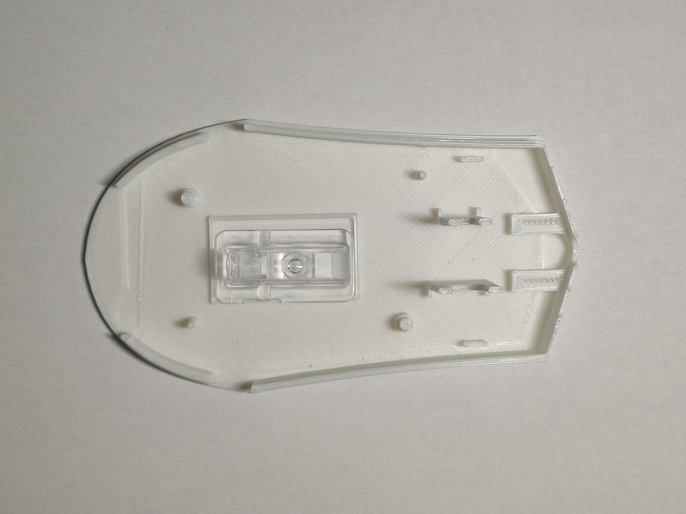

# Placing Electronics inside

## Step 1:
Place the Optics inside

## Step 2:
Place the rest  
Make sure it is right on the pins so it stays in place  

## Step 3:
now we can put the bottom on the top

## Step 4: 
Now we just put two screws it the front and everything is done

## Step 5:

Optionaly we can fill the impervections with some sealer 
and Spray Paint it at the end.