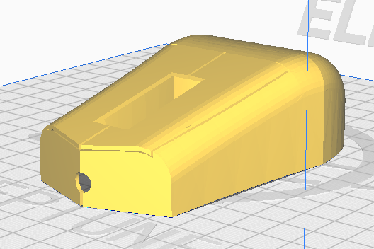

# Jak vytisknout model

## Krok 1:

Stáhněte si model a umístěte jej do nástroje slicer(ideálně cura nebo prusaslicer)

## Krok 2:

Horní model potřebuje podporu = úhel převisu podpory kolem 60 stupňů  
Také u modelu Top můžete tisknout i vzhůru nohama pro méně podpěr, ale tisk nebude tak hladký.

Spodní model nepotřebuje žádné podpory
## Krok 3:

Výška vrstvy by měla být 0,2, aby myš vypadala lépe. 0,3 také vyhovuje.
Rychlost někde mezi 60-100 mm/s

## Krok 4:

Po dokončení tisku jej můžete vyhladit smirkovým papírem, pokud chcete.