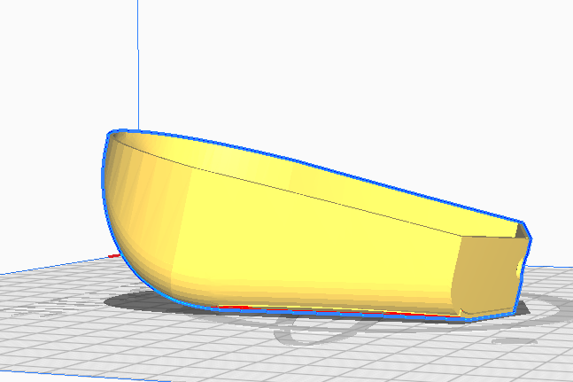

# How to print the model

## Step 1:

Download the model and place it in slicer(idealy cura or prusaslicer)

## Step 2:

Top model needs support = Support Overhang Angle around 60degrees  
Also in the Top model you can print also upside down for less supports but the print won´t be as smooth  

Bottom part does not need any supports
## Step 3:

Layer hight should be 0.2 for a better looking mouse, but 0.3 also fits
Speed somewhere between 60-100mm/s

## Step 4:

Finaly after the print you can make it more smooth with sandpaper if you want.