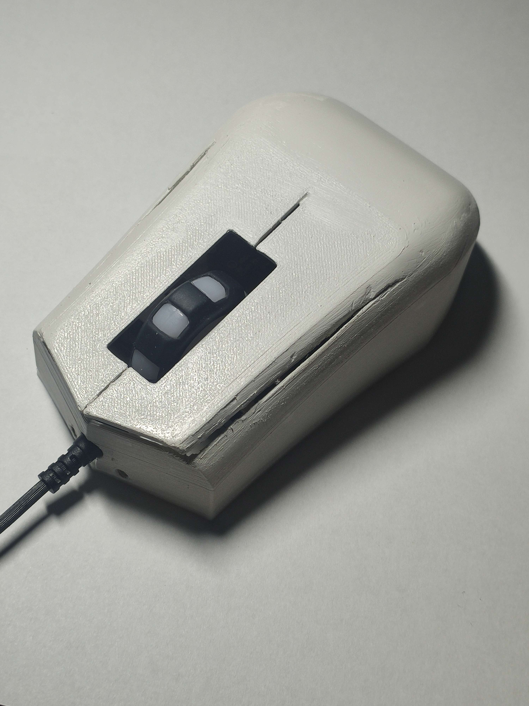

# Náhradní kryt pro marvo m207

Můj náhradní kryt myši je snadno použitelný a sestavený kryt pro lidi, kteří mají myš
nějakým způsobem poškozenou nebo jen chtějí jiný design. Jako hlavní nástroj využívá 3D tisk.
## Co potřebujete?

* 3D tiskárna
* Okolo 35g jakého koliv filamentu(testováno s pla)
* [Vnitřnosti Marvo m207](https://www.datart.cz/marvo-mys-m207-2400dpi-optika-6tl-1-kolecko-dratova-usb-cerna-herni-podsvicena-m207.html?gclid=Cj0KCQjwj_ajBhCqARIsAA37s0yOHEzQcGkIXNLW-GMfn9_XcU6I3zXoe4B2Vjl9shj3v5adB2rEeUIaAsIuEALw_wcB)
* 2 Screws M3x6mm
* (Není nutné) [Polyesterový plnič](https://www.amazon.com/Purpose-Moldable-Sealing-Permanent-Ceramics/dp/B0B7BNSRJ5/ref=sr_1_5?keywords=polyester+finishing+putty&qid=1687204929&sr=8-5)
* (Není nutné) [Plnič ve spreji](https://www.amazon.com/Krylon-K05515007-COLORmaxx-Spray-Aerosol/dp/B07LFPD9YX/ref=sr_1_6?keywords=clear+acrylic+spray&qid=1687205465&sr=8-6)
* cena: 140Kč
## Dokumentace

* [Bottom Model](https://github.com/pslib-cz/2022-p2a-mme-pppp-PetrMachacka/blob/main/Bottom.stl)
* [Top Model](https://github.com/pslib-cz/2022-p2a-mme-pppp-PetrMachacka/blob/main/Top.stl)
* [Jak Tisknout](Print.md)
* [Elektronika + Sestavení](Electronics.md)

## TODO List 
- [ ] Tisk
- [ ] Vložení elektroniky
- [ ] Finální složení