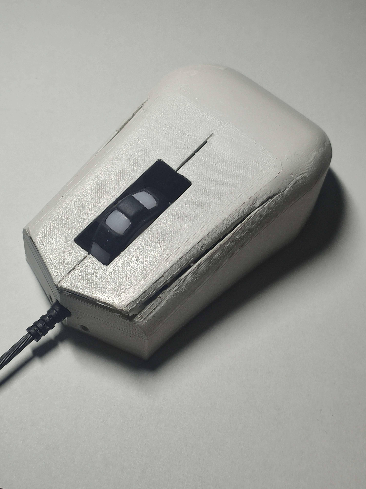

# replacement mouse cover for Marvo m207

My replacement mouse cover is easy to use and assembled cover for people whos mouse cover  
was damaged in any way or they just want different design. It uses 3D printing as a main tool 
## What do you need?

* 3D Printer
* Around 35g of any filament(tested with pla)
* [Insides of Marvo m207](https://www.bestbuy.ca/en-ca/product/marvo-m207-wired-3200dpi-gamimg-optical-7-color-backlight-6-buttons-mouse/16037091)
* 2 Screws M3x6mm
* (optional) [Polyester Putty](https://www.amazon.com/Purpose-Moldable-Sealing-Permanent-Ceramics/dp/B0B7BNSRJ5/ref=sr_1_5?keywords=polyester+finishing+putty&qid=1687204929&sr=8-5)
* (optional) [Spray Paint](https://www.amazon.com/Krylon-K05515007-COLORmaxx-Spray-Aerosol/dp/B07LFPD9YX/ref=sr_1_6?keywords=clear+acrylic+spray&qid=1687205465&sr=8-6)
* Price: $30;
## Documentation

* [Bottom Model](https://github.com/pslib-cz/2022-p2a-mme-pppp-PetrMachacka/blob/main/Bottom.stl)
* [Top Model](https://github.com/pslib-cz/2022-p2a-mme-pppp-PetrMachacka/blob/main/Top.stl)
* [How to print](Print.md)
* [Electronics + Assembly](Electronics.md)

## TODO List 
- [ ] Print
- [ ] Insert Electronics
- [ ] Final Assembly
